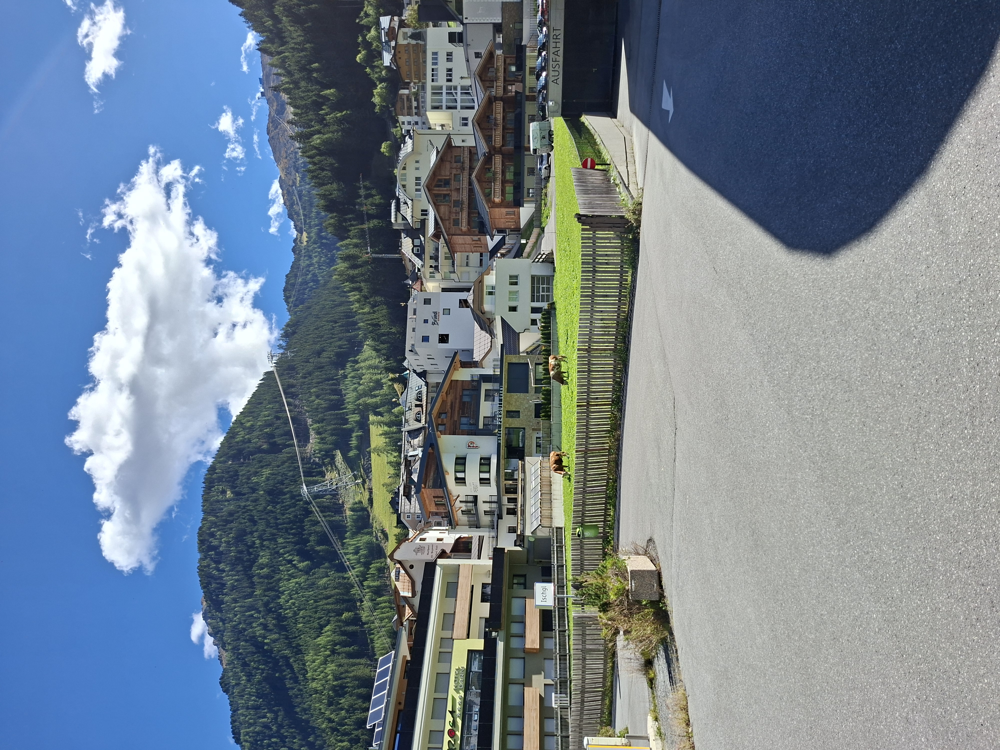
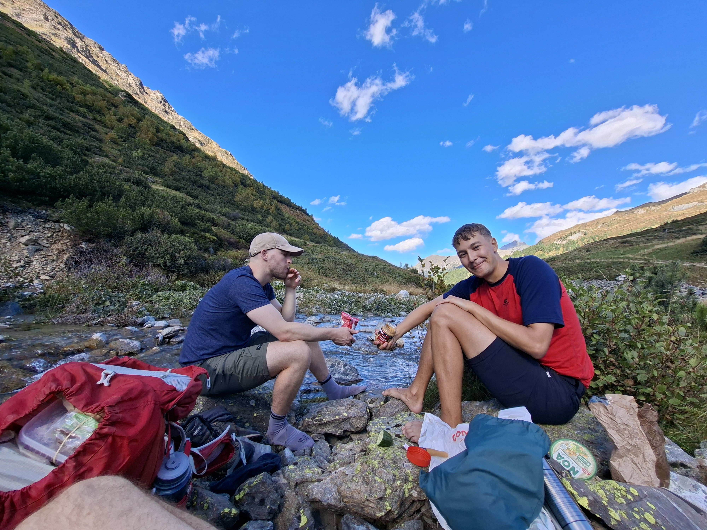
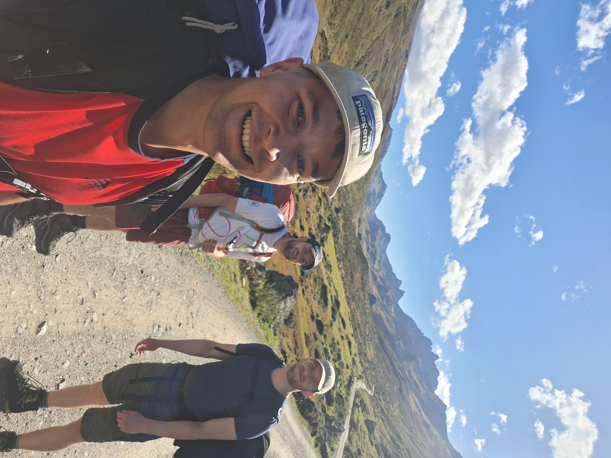
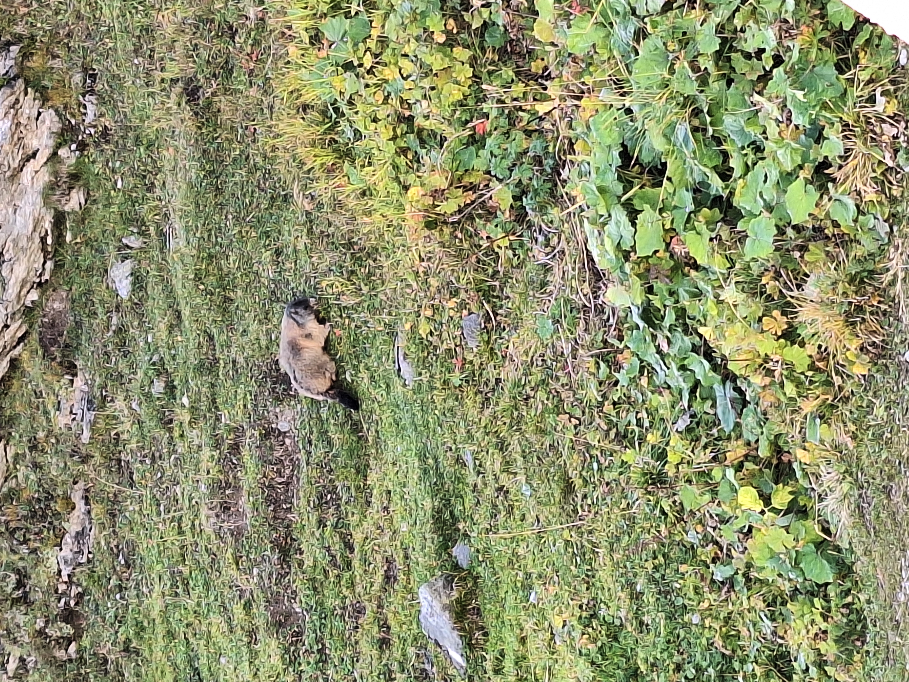
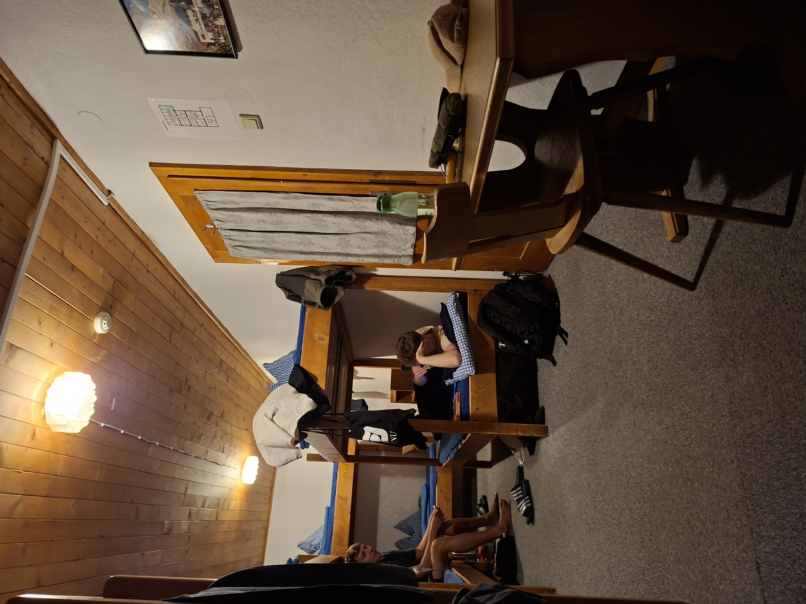

# Tag 1 – Ischgl → Heidelberger Hütte

Montag 7:50 Uhr, München. RB54 nach Kufstein fährt pünktlich ab. Mit an Bord: Till, Kilian und Julian. Einer hat einen zu großen Rucksack, einer hat einen schlechten Rucksack, und einer hat einfach Hermine Grangers Handtasche und zaubert eine Menge aus einem kleinen Rucksack heraus!
Umstieg in Kufstein in den RJX nach Landeck und weiter in einer Odysee an Busfahrt nach Ischgl, dem Ausgangspunkt unseres Abenteuers. 
Weil sich Lukas einen miesen RNA Virus eingefangen hat und noch Sport Pause machen muss, geht der Spaß erstmal ohne ihn los 🤷‍♂️

Bei absolutem Kaiserwetter starten wir rein!

Nach einiger Zeit auf der Straße kommen wir endlich auf einen Kies Weg...

... und machen direkt eine Snack Pause am Fluss. 2 Gläser Crunchy Peanut Butter werden Kilian und mich die nächsten Tage mit der nötigen Energie versorgen! 💪

Die Lanschaft wird immer prächtiger!!!

Und bald sehen wir auch schon die Heidelberger Hütte 👏

Man glaubts kaum aber diese befindet sich in der Schweiz! 🇨🇭 Allerdings ist die Hütte nur von Österreich aus zu erreichen 😁 

Trotzdem heißt das: Roaming aus 😱

Um die Hütte tummeln sich eine Meeeenge knuffiger Murmeltiere die alle schon ordentlich Winterspeck angelegt haben.

Trotz gutem Wetter ist die Hütte ziemlich leer und wir haben Glück und bekommen ein Mehrbettzimmer für uns alleine!

Doch müder als gedacht vom ersten Tag gehen wir früh schlafen.

Track 1. Tag: https://www.alpenvereinaktiv.com/de/track/aufzeichnung-am-15.09.2025-12-36-24/326503533/

Distanz: 14,1 km

Höhenmeter: 922 hm

Aufgezeichnete Zeit: 4:25h

Weiter zu [➡️ Tag 2](tag2.md)

[⬅️ Zurück zur Übersicht](index.md)
