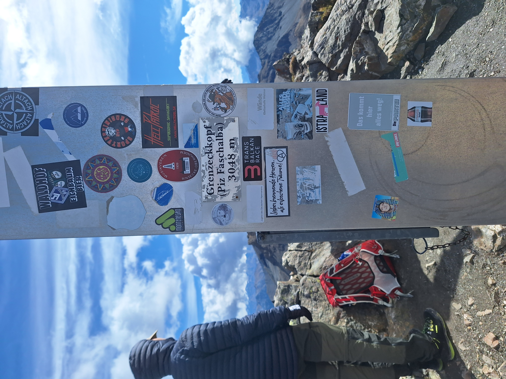

# Tag 2 – Heidelberger Hütte → Jamtal Hütte

Gut ausgeruht sagen wir Tschüss zur Heidelberger Hütte...

... und beginnen unseren Weg vorerst ohne Frühstück Richtung Kronenjoch auf 2975 m
Kilian und ich jammern über den ersten Muskelkater vom Rucksack während Till leichtfüßig voranschreitet.
Landschaft ist aber atemberaubend! Schaut euch diese Farben an! In der Ferne sieht man die ersten 3000er aufragen. Hier konkret das Mittlere Fluchthorn 3397 Meter 😍

Auf dem Weg endecken wir diesen Tech mit Kaulquappen, nicht schlecht für die Höhe!

Bald schon erreichen wir das Kronenjoch. Ziemlich mieser Wind da oben... wir stellen die Rucksäcke ab und machen uns auf zum aller ersten Gipfel der Tour: Piz Faschalba (Grenzkopf) auf 3047 Metern.
Kilians erster 3000er! 😇

Ich glaube kältester Moment auf der Tour mit 0 Grad und nem kräftigen Wind.

Gipfelbucheintrag: check ☑️

Gipfelfoto darf nicht fehlen!

Schließlich erreichen wir die Jamtalhütte. Diese ist wirklich eine Vorzeigehütte. Automatische Türen, Platz für gefühlt 300 Bergsteiger*innen. Wir treffen den Hüttenwirt auf der Terasse und er merkt sofort, dass wir was frisches kühles brauchen

Schon wieder treffen wir auf eine extrem leere Hütte und kriegen schon wieder ein Lager für uns alleine ☺️ 
Am Abend gibt's endlich ne warme Mahlzeit nachdem wir bis hierhin nur unser mitgeschlepptes Essen verputzt haben. Brokkolicreme Suppe mit Nachschlag, Pilzrisotto und für mich als Nachtisch Zitroneneis mit geschnittenen Äpfeln, Bananen sowie Sahne als Nachtisch. Das war lecker aber auch super weird...

Nach einer Stunde Cabo/Kaboom spielen wird es etwas fad, also geben Kilian und ich Till schon früher als geplant sein Geburtstagsgeschenk: SKULLKING! 

Wir zocken direkt los, tolles game! Eigentlich wie die 25 Jahre Wizard Jubiläumsedition aber noch mit paar extra Regeln on top!

Tag 2 Ende :)

Statistik ist recht ähnlich zu Tag 1: 
Track 2. Tag: https://www.alpenvereinaktiv.com/de/track/aufzeichnung-am-16.09.2025-08-53-45/326503522/#caml=av4,1oxa65,7r200i,-2o7r,0&dm=1
Distanz: 13,7 km
Höhenmeter: 890 hm
Aufgezeichnete Zeit: 6:31h

Weiter zu [➡️ Tag 3](tag3.md)

Zurück zu [⬅️ Tag 2](tag2.md)

[⬅️ Zurück zur Übersicht](index.md)
